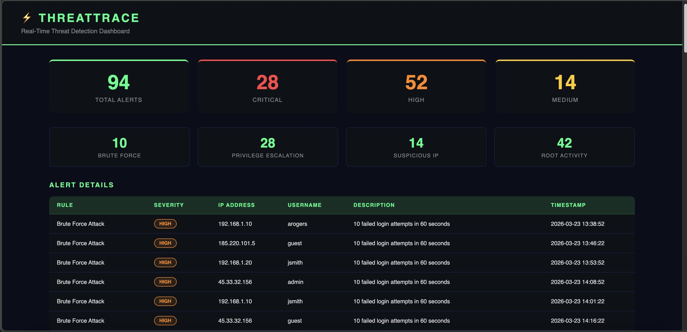
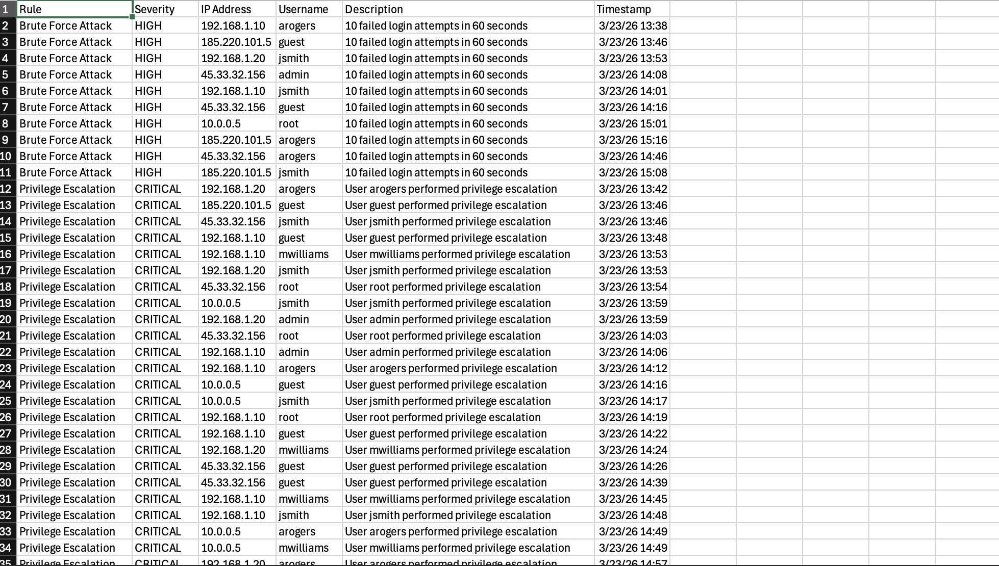

# ThreatTrace ⚡
A Python-based SIEM log analyzer that automatically detects security threats including brute force attacks, privilege escalation, suspicious IP activity, and root account abuse through automated detection rules and a real-time alert dashboard.

## Screenshots

*ThreatTrace real-time threat detection dashboard displaying 94 security alerts across 4 threat categories with severity classification*

*ThreatTrace generating timestamped CSV threat intelligence report with 94 alerts across all severity levels*

## Features
- Realistic authentication log generation for testing and demonstration
- Log normalization and parsing engine
- Automated threat detection rules for 4 attack categories
- Real-time alert dashboard with severity classification
- CSV report export for management reporting and compliance

## Detection Rules
- Brute Force Attack — flags 5+ failed logins within 60 seconds
- Privilege Escalation — flags any privilege elevation event
- Suspicious External IP — flags successful logins from unknown IPs
- Root Account Activity — flags any root account actions

## Tech Stack
- Python 3
- Flask
- Collections and DateTime libraries
- CSV reporting

## Setup
Clone the repository and navigate into it, then create and activate a virtual environment and install flask using pip3 install flask. Set your PYTHONPATH to the project root.

## Usage
Generate logs by running python3 logs/log_generator.py, then launch the dashboard with python3 dashboard/app.py and open your browser at http://127.0.0.1:5000

## Alert Severity Levels
- CRITICAL — Privilege escalation events requiring immediate response
- HIGH — Brute force attacks and root account activity
- MEDIUM — Suspicious external IP logins

## Author
ShayVon Ballard
- GitHub: https://github.com/shayvon-ballard
- VulnTracker: https://github.com/shayvon-ballard/vulntracker